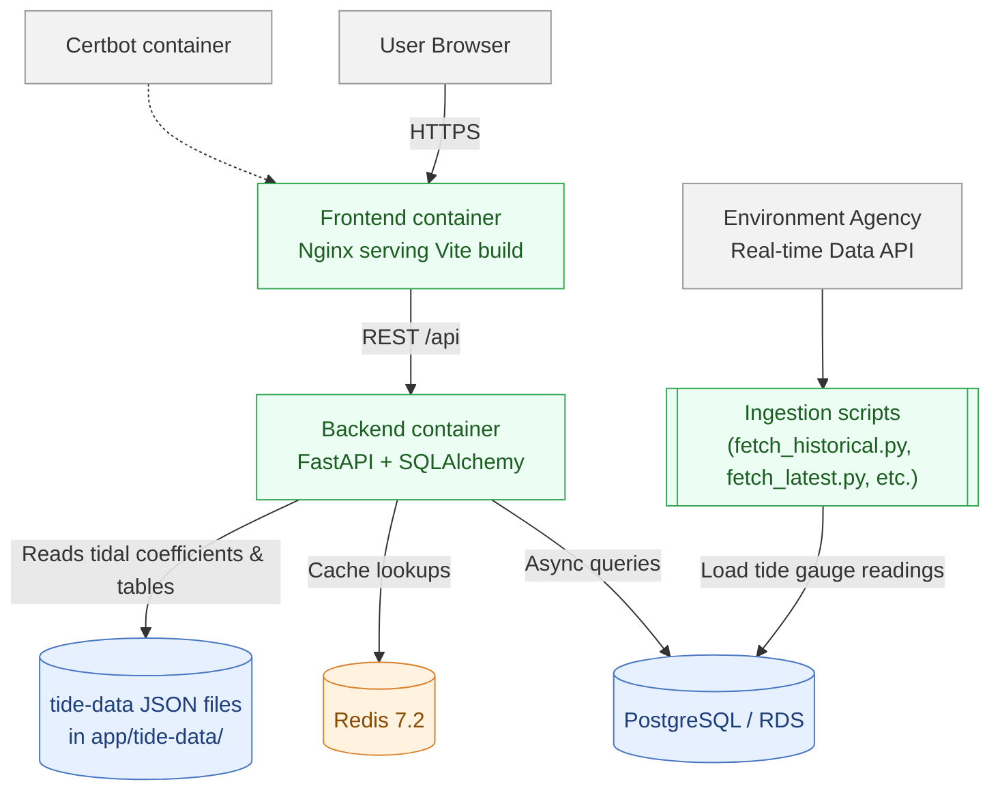

# System Architecture

Below is a high-level view of the stack, data paths, and where caching and static tide assets sit.

## Notes
- Frontend builds with Vite and is served by Nginx in the `frontend` container; dev mode uses the Vite dev server (see `docker-compose.dev.yml`).
- Backend is FastAPI with async SQLAlchemy. DB connection string comes from `DATABASE_URL_SQLALCHEMY` (often an external Postgres/RDS instance). 
- Redis provides caching for station lists and per-station readings; TTL is controlled via `CACHE_TIME_LIMIT`.
- Static tidal assets (coefficients and tables) live under `app/tide-data/` and are read at request time.
- Ingestion scripts under `scripts/` pull Environment Agency tide gauge data and write into Postgres.
- Certbot sidecar shares volumes with the frontend container to manage TLS certificates for Nginx.
