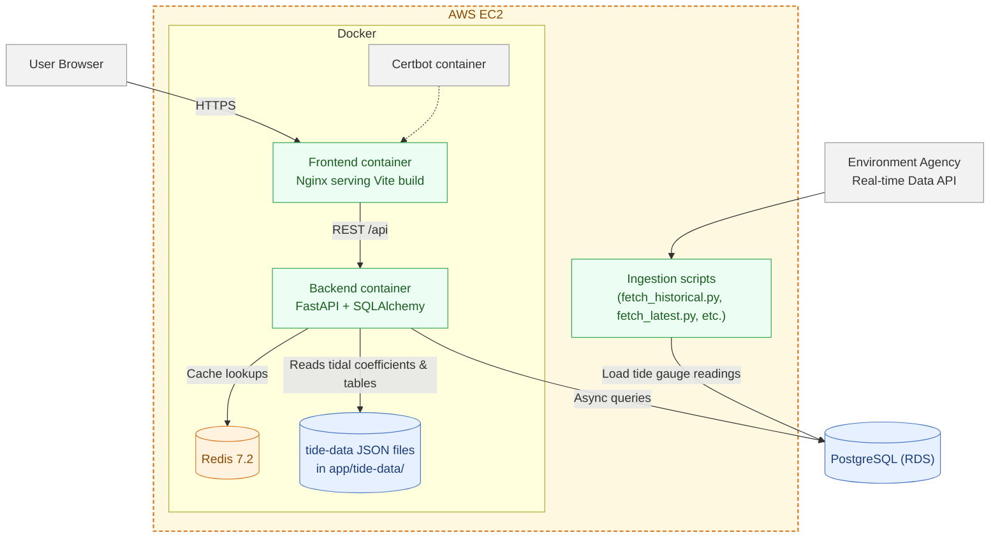

# System Architecture

## Notes
- Frontend builds with Vite and is served by Nginx in the `frontend` container.
- Backend is FastAPI with async SQLAlchemy. DB connection string comes from `DATABASE_URL_SQLALCHEMY` and points to PostgreSQL on RDS.
- Redis provides caching for station lists and per-station readings. TTL is controlled via `CACHE_TIME_LIMIT` in the `.env` variables.
- Static tidal assets (coefficients and tables) live under `app/tide-data/` and are read at request time. they’re generated once and bundled in the backend container.
- Ingestion scripts under `scripts/` pull Environment Agency tide gauge data and write into the DB. Cron jobs run on the EC2 host to pull data every hour.
- SSL is terminated by the certbot-managed Nginx setup.
