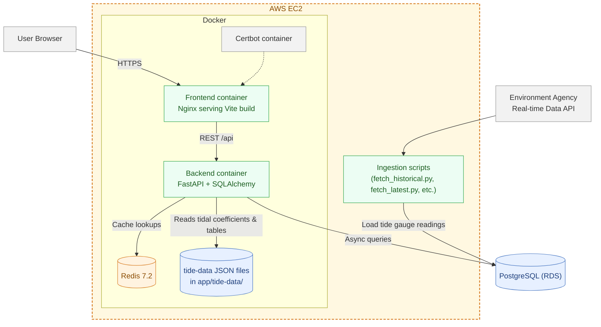

<!-- Improved compatibility of back to top link: See: https://github.com/othneildrew/Best-README-Template/pull/73 -->
<!-- TTemplate procided by https://github.com/othneildrew/Best-README-Template -->
<a id="readme-top"></a>
</br>
[![Contributors][contributors-shield]][contributors-url]
[![Forks][forks-shield]][forks-url]
[![Stargazers][stars-shield]][stars-url]
[![Issues][issues-shield]][issues-url]
[![GNU-GPL-v3][license-shield]][license-url]
<div align="center">


  <h3 align="center"><b>TideNet</b></h3>

  <p align="center">
    <i>near real‑time tide and surge readings for UK coasts</i>
    <br />
    <a href="https://tidenet.app/"><strong>Explore the live version »</strong></a>
    <br />
    <br />
    <a href="https://github.com/nikolisan/tidenet.app/issues/new?labels=bug&template=bug_report.md">Report Bug</a>
    &middot;
    <a href="https://github.com/nikolisan/tidenet.app/issues/new?labels=enhancement&template=feature_request.md">Request Feature</a>
  </p>
</div>

<details>
  <summary>Table of Contents</summary>
  <ol>
    <li><a href="#about-the-project">About The Project</a></li>
    <li><a href="#data-source">Data source</a></li>
    <li><a href="#features">Features</a></li>
    <li><a href="#system-architecture">System Architecture</a></li>
    <li><a href="#api-summary">API Summary</a></li>
    <li>
      <a href="#getting-started">Getting Started</a>
      <ul>
        <li><a href="#installation">Installation</a></li>
        <li><a href="#configuration">Configuration</a></li>
      </ul>
    </li>
    <li><a href="#data--ingestion">Data & Ingestion</a></li>
    <li><a href="#contributing">Contributing</a></li>
    <li><a href="#license">License</a></li>
    <li><a href="#acknowledgements">Acknowledgements</a></li>
  </ol>
</details>


---
## About The Project

The application ingests tide gauge readings, predicts astronomical tide from precomputed harmonic constituents, and surfaces residual surge via a web UI and a REST API.

### Built With
[](https://fastapi.tiangolo.com/)
[](https://www.python.org/)
[](https://vite.dev/)
[](https://react.dev/)
[](https://daisyui.com/)
[](https://tailwindcss.com/)

<p align="right">(<a href="#readme-top">back to top</a>)</p>

## Data Source
This uses Environment Agency tide gauge data from the real-time data API (Beta).
Read more at the [official API documentation][API-Documentation-link].

Astronomical tide predictions are generated using Python UTide: https://github.com/wesleybowman/UTide/tree/master

<p align="right">(<a href="#readme-top">back to top</a>)</p>

## Features
- FastAPI backend with async SQLAlchemy and Redis caching.
- React + Vite frontend with Tailwind CSS styling.
- Astronomical tide reconstruction from station-specific harmonic coefficients.
- Cached station list and per‑station time series for responsive UX.
- Dockerized services and Nginx static hosting; Certbot for TLS.

<p align="right">(<a href="#readme-top">back to top</a>)</p>

# System Architecture



## Notes
- Frontend builds with Vite and is served by Nginx in the `frontend` container.
- Backend is FastAPI with async SQLAlchemy. DB connection string comes from `DATABASE_URL_SQLALCHEMY` and points to PostgreSQL on RDS.
- Redis provides caching for station lists and per-station readings. TTL is controlled via `CACHE_TIME_LIMIT` in the `.env` variables.
- Static tidal assets (coefficients and tables) live under `app/tide-data/` and are read at request time. they’re generated once and bundled in the backend container.
- Ingestion scripts under `scripts/` pull Environment Agency tide gauge data and write into the DB. Cron jobs run on the EC2 host to pull data every hour.
- SSL is terminated by the certbot-managed Nginx setup.
<p align="right">(<a href="#readme-top">back to top</a>)</p>

## API Summary
> *In production the API is not externall accessible.*
- `GET /api/stations` — Summary of stations, coordinates, and latest readings.
- `GET /api/data/{station_label}?start_date=...&end_date=...` — Time series with observed values, astronomical tide, and surge residual; Redis‑cached windows supported.
- `GET /api/data/{station_label}/table` — Tide table metrics (e.g., MHWS/MLWS) for the station.

<p align="right">(<a href="#readme-top">back to top</a>)</p>

## Getting Started
This builds and runs the Nginx‑served frontend and the FastAPI backend, along with Redis and Certbot volumes for TLS. Configure backend variables via `.env` and frontend via `frontend/.env`.

### Installation

1. *Clone the repo*

   ```bash
   git clone https://github.com/nikolisan/xb-gui.git
   ```
   > ℹ If you do not have a `git` client, simply unzip the [source code repository](https://github.com/nikolisan/tidenet.app/archive/master.zip).

2. Build and start the containers

    ```bash
    docker compose up --build -d
    ```
3. (Optional) Follow the logs
    ```bash
    docker compose logs frontend -f
    docker compose logs backend -f
    ```
<p align="right">(<a href="#readme-top">back to top</a>)</p>

### Configuration
Backend environment variables:
- `DATABASE_URL_SQLALCHEMY` — SQLAlchemy connection string (eg. `postgresql+psycopg://{USER}:{PASSWORD}@{DB_HOST}:{PORT}/{DB_NAME` )
- `REDIS_HOST` — `"redis"`
- `REDIS_PORT` — `6379`
- `CACHE_TIME_LIMIT` — Cache TTL in seconds (default `3600`)
- `API_ROOT` — Base URL for the Tide Gauge API (`"https://environment.data.gov.uk/flood-monitoring"`)
- `MEASURES_URI` — Endpoint for the station measures (`"/id/measures?stationType=TideGauge&unitName=mAOD"`)

Frontend environment variables:
- `VITE_API_BASE_URL` — Backend API base URL (for production `/api`)
- `VITE_LIGHT_THEME` — Custom DaisyUI light theme (`light`)
- `VITE_DARK_THEME` — Custom DaisyUI dark theme (`dark`)
<p align="right">(<a href="#readme-top">back to top</a>)</p>

## Data & Ingestion
- Static tidal assets (coefficients and tables) live under `app/tide-data/` and are bundled with the backend image.
- Ingestion scripts in `scripts/` (e.g., `fetch_historical.py`, `fetch_latest.py`) populate the database. In production, cron jobs on the EC2 host trigger periodic updates.
<p align="right">(<a href="#readme-top">back to top</a>)</p>

## Contributing
Issues and PRs are welcome. Please keep changes focused and include small, targeted tests or reproducible steps where possible.

<p align="right">(<a href="#readme-top">back to top</a>)</p>

## License
Distributed under the MIT license. See [LICENSE.md](LICENSE.md) for more information.

<p align="right">(<a href="#readme-top">back to top</a>)</p>

## Acknowledgements
Thanks to the Environment Agency for providing the real‑time data API and to the open‑source community behind UTide, FastAPI, SQLAlchemy, Redis, React, Vite, Lucide, daisyUI and Tailwind CSS.
<p align="right">(<a href="#readme-top">back to top</a>)</p>

[API-Documentation-link]: https://environment.data.gov.uk/flood-monitoring/doc/tidegauge#:~:text=The%20real%2Dtime%20data%20API%20provides%20information%20on%20readings%20of,both%20rainfall%20and%20air%20temperature

[contributors-shield]: https://img.shields.io/github/contributors/nikolisan/tidenet.app.svg?style=for-the-badge
[contributors-url]: https://github.com/nikolisan/tidenet.app/graphs/contributors
[forks-shield]: https://img.shields.io/github/forks/nikolisan/tidenet.app.svg?style=for-the-badge
[forks-url]: https://github.com/nikolisan/tidenet.app/network/members
[stars-shield]: https://img.shields.io/github/stars/nikolisan/tidenet.app.svg?style=for-the-badge
[stars-url]: https://github.com/nikolisan/tidenet.app/stargazers
[issues-shield]: https://img.shields.io/github/issues/nikolisan/tidenet.app.svg?style=for-the-badge
[issues-url]: https://github.com/nikolisan/tidenet.app/issues
[license-shield]: https://img.shields.io/github/license/nikolisan/tidenet.app.svg?style=for-the-badge
[license-url]: https://github.com/nikolisan/tidenet.app/blob/master/LICENSE.txt